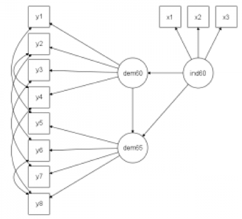
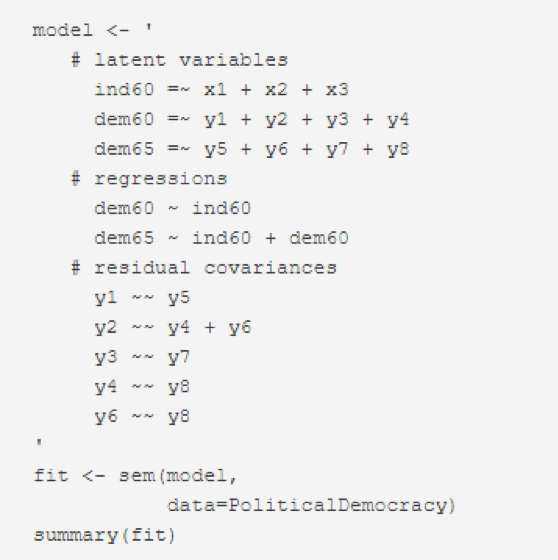

####  Intro to Structural Equation Modeling

SEM is a combination of factor analysis and multiple regression. It also goes by the aliases “causal modeling” and “analysis of covariance structure”. A special case of SEM includes confirmatory factor analysis and path analysis. The SEM can be divided into two parts. The measurement model is the part which relates measured variables to latent variables. The structural model is the part that relates latent variables to one another. The path analysis, which is SEM with no latent variables. In other words, path analysis is SEM with a structural model, but no measurement model. A structural equation modeling (SEM) has only single indicators are employed for each of the variables in the causal model.

In this project, we leverage statistical and mathematical tools, along with SEM principles, to learn about systems. Strictly speaking, SEM is not a purely statistical method, but rather, a modeling framework. The literature often equates the methodology of SEM with particular implementations of SEM. So, sometimes you hear people say, for example, “SEM involves the analysis of covariances” or ask, “What are the statistical assumptions of the method?” The proper replies are, “That depends on how a particular model is represented and estimated.” In other words, SEM is a framework for representing and evaluating causal hypotheses, not a particular statistical technique. The contrast being established here is very important. Most scientists’ training about quantitative analysis comes solely from the field of statistics. However, there is another field, that of causal analysis. Both these bodies of knowledge are vitally important to science. Also important is that traditional methods of statistical analysis are reductionist and aim to isolate associations. SEM takes a system perspective. This turns out to be essential to representing causal hypotheses fully.

 

Figure 1. An example of the layout in SEM that represents components in the proposed hypothesis to test.

 

Figure 2. The corresponding syntax in the lavaan package to implement the test shown in figure 1.

 

Here are a few useful references on SEM fundamentals 
-	A very good tutorial on SEM from Dr. James Grace at [here](https://www.usgs.gov/centers/wetland-and-aquatic-research-center/science/quantitative-analysis-using-structural-equation?qt-science_center_objects=0#qt-science_center_objects).
-	Karl Wuensch from ECU posts the teaching [note](http://core.ecu.edu/psyc/wuenschk/StatsLessons.htm#Path) for SEM.
-	David Kenny used to post a lot of videos, but his site becomes unresponsive now. Someone saved some of his slides and can be reviewed [here](https://slideplayer.com/slide/4682437/)
-	Dr. William Revelle from North Western University has his teaching note from 2016 [posted](http://personality-project.org/revelle/syllabi/454/454.syllabus.pdf)
-	Dr. Brannick from USF has a good [post](http://faculty.cas.usf.edu/mbrannick/regression/SEM.html) on SEM vs. Path Analysis
