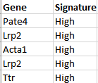

####  Data Format

- Must be .xlsx files.
- The model/human signature file should have two columns, the genes in the first column and the activated/deactivated (high/low) status in the second column.

- The human microarray file's first column contains the genes. The second column usually contains the probes, but can also be blank. The third column and onwards should be the variable values.

- The subset file's first column contains the regulator name. The last column are the genes of the regulator that are to be removed, listed in one cell and separated by commas, i.e. ABCA3,ABCC5,ACADM,ACPP,.... Any cells between the first and last columns (exclusive) are irrelevant. 

 

 
####  How To Use

1. Upload the signature file in the first file explorer ("Upload the signature file") of the side bar. If the signatures are from mice, then select `Mouse` to have the app convert the genes from mouse to human. Otherwise, select `Human`.
2. Upload the human microarray file in the second file explorer of the side bar. 
3. Click **Go!** after uploading and confirming the settings of these two files. The T-score calculation will start happening and will be finished when the calculated table of T-scores appears in the *T-scores* tab.
4. To use the *bootstrap* tab, steps 1-3 should already have been performed. Upload the subset file to the only file explorer in the tab. There are two types of boostrap simulation: "Elimination with replacement" and "Elimination without replacement". Make a selection to run desired boostrap analysis. Enter in the number of random runs for the negative control (default = 1000). 
5. Click **Go!** and a progress bar will appear in the bottom-right, indicating the T-scores calculation process. When calculations are done, a list of T-score csv files will appear. Click **Download as zip** to download the files.
 

####  Two category boostrap illustration

 

 
####  Other Information
- The human microarray set will automatically have repeat genes filtered out (keep highest stdev of same gene rows) and be normalized (median-shifted)
  